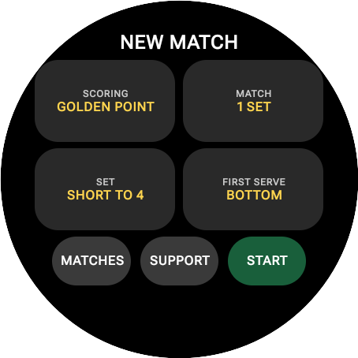
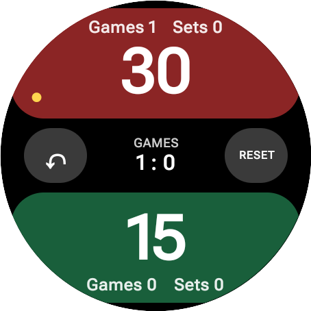
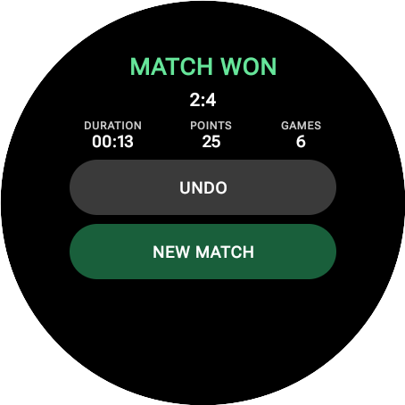
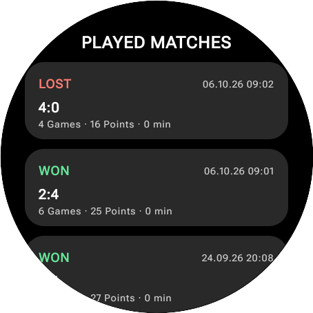

# 🎾 Padel Score for Wear OS

<p align="center">
  
</p>

<p align="center">
  <strong>A standalone, privacy-first Wear OS smartwatch app for keeping score during padel matches — 100% offline match scoring, fast, and effortless.</strong>
</p>

<p align="center">
  <a href="https://github.com/Hygros/PadelScore/releases"></a>
  <a href="https://developer.android.com/wear"></a>
  <a href="LICENSE"></a>
  <a href="#privacy"></a>
</p>

---

## 📱 Screenshots

<p align="center">
  
  &nbsp;&nbsp;
  
  &nbsp;&nbsp;
  
  &nbsp;&nbsp;
  
</p>

<p align="center">
  <sub><b>Match Setup</b> &nbsp;•&nbsp; <b>Live Scoring</b> &nbsp;•&nbsp; <b>Match Summary</b> &nbsp;•&nbsp; <b>Local History</b></sub>
</p>

---

## ✨ Features

- 🎾 **Official Padel Scoring Rules**: Standard scoring (`0`, `15`, `30`, `40`), Advantage, Golden Point, and Star Point modes.
- ⚙️ **Flexible Match Formats**: Single set, Best-of-3 sets, Short sets (to 4 games) or Normal sets (to 6 games), set tie-breaks, and match tie-breaks.
- 🟡 **Smart Serve Rotation**: Visual serve indicator on screen with precise rotation calculations (including 1-2-2 tie-break sequences).
- 🎯 **Court-Optimized Interface**: High-contrast, large touch targets designed specifically for quick, reliable taps on smartwatch displays.
- 📳 **Haptic Feedback & Safety Lock**: Tactile feedback on points and a 300 ms input lock to prevent unintended double-taps during intense play.
- ↺ **Instant Undo & Safety Reset**: Effortlessly reverse accidental points or long-press to reset match state safely.
- 📜 **Local Match History**: View saved match details on your wrist, including date, final scores, total points, total games, and duration.
- 🔋 **Always-On Display (AOD)**: Ambient display support keeps the score visible while conserving watch battery.
- 🔒 **100% Standalone & Offline Match Scoring**: No companion phone app needed, no internet permissions declared, no user tracking.
- 💖 **Optional Supporter Feature**: Includes an optional Support page integrated with Google Play In-App Billing for voluntary developer contributions.

---

## 🚀 Quick Start / Download

### Download APK Release
Download the latest APK directly from the [GitHub Releases](https://github.com/Hygros/PadelScore/releases) page.

- **`PadelScore-v1.0-debug.apk`**: Pre-signed debug APK, ready to sideload directly onto any Wear OS watch.
- **`PadelScore-v1.0-release-unsigned.apk`**: Unsigned release APK for custom signing.

### Installing on Wear OS Smartwatch

You can install the APK onto your Wear OS watch using **ADB over Wi-Fi**:

1. **Enable Developer Options & Wireless Debugging** on your watch (`Settings > System > About > tap Build Number 7 times`, then `Settings > Developer Options > Wireless Debugging`).
2. **Connect via ADB** on your computer:
   ```powershell
   $Adb = "$env:LOCALAPPDATA\Android\Sdk\platform-tools\adb.exe"
   & $Adb connect <WATCH_IP_ADDRESS>:5555
   ```
3. **Install the APK**:
   ```powershell
   & $Adb install -r releases/PadelScore-v1.0-debug.apk
   ```

*Alternatively, you can use phone apps like **Bugjaeger** or **Easy Fire Tools** to sideload the APK directly from your Android phone to your watch over Wi-Fi.*

---

## 🔒 Privacy & Network Usage

Padel Score is built with privacy in mind:

- ❌ No `android.permission.INTERNET` requested in the app manifest.
- ❌ No user accounts or logins required.
- ❌ No analytics, telemetry, crash reporting, or tracking scripts.
- ❌ No background cloud sync or remote servers.

**Match Scoring & History**: Operates 100% offline. All match data, undo state, and history logs are stored strictly in local device storage.

**Optional Supporter Page**: The Support screen connects locally to Google Play Services via the official Google Play Billing Library to handle optional voluntary tips/purchases through your Google Play Account.

---

## 🛠️ Requirements & Building from Source

### Prerequisites
- **Java**: JDK 25 (required for the Gradle daemon)
- **Gradle**: 9.6.0 (via included Gradle Wrapper `gradlew`)
- **Android SDK**: Compile SDK 37, Minimum SDK 30 (Wear OS 3.0+)

### Build Commands

Run the included Gradle wrapper from PowerShell or Terminal:

```powershell
# Set JAVA_HOME to JDK 25
$env:JAVA_HOME = 'C:\Program Files\Android\Android Studio\jbr' # or your JDK 25 path
$env:Path = "$env:JAVA_HOME\bin;$env:Path"

# Run Unit Tests
.\gradlew.bat testDebugUnitTest

# Assemble Debug APK (signed with debug keystore)
.\gradlew.bat assembleDebug

# Assemble Release APK
.\gradlew.bat assembleRelease
```

Generated APKs will be located in:
- Debug APK: `app/build/outputs/apk/debug/app-debug.apk`
- Release APK: `app/build/outputs/apk/release/app-release-unsigned.apk`

### Signing Release Builds
Release signing can be configured via environment variables:
- `PADELSCORE_UPLOAD_STORE_FILE`
- `PADELSCORE_UPLOAD_STORE_PASSWORD`
- `PADELSCORE_UPLOAD_KEY_ALIAS`
- `PADELSCORE_UPLOAD_KEY_PASSWORD`

---

## 📂 Project Structure

```text
app/src/main/java/ch/hygro/padelscore/
├── billing/        # Google Play Billing Integration for optional Supporter page
├── logic/          # Core scoring engine & serve calculator
├── model/          # Match configuration and scoring data models
├── presentation/   # Wear OS Jetpack Compose UI screens & components
├── storage/        # Offline local match storage & persistence
└── vibration/      # Wrist haptic feedback engine

app/src/test/java/ch/hygro/padelscore/logic/  # Comprehensive unit test suite
```

---

## 📄 License

This project is licensed under the **Apache License 2.0** - see the [LICENSE](LICENSE) file for details.

---

<p align="center">
  <sub>Application ID: <code>ch.hygro.padelscore</code></sub>
</p>
